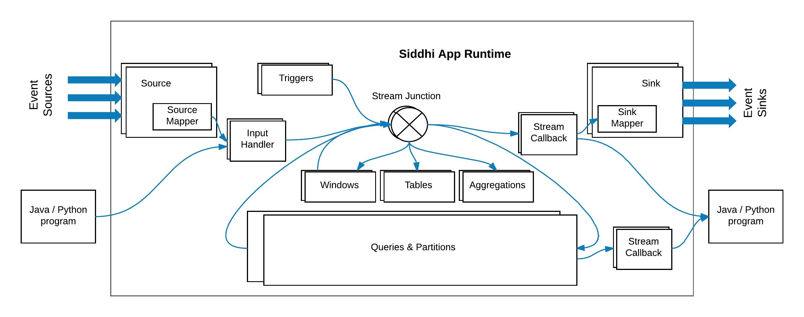
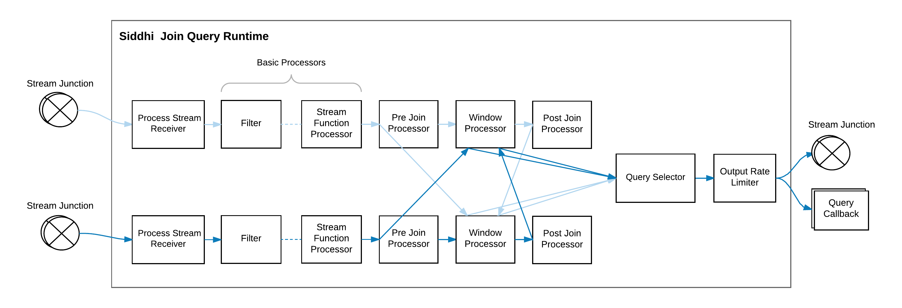
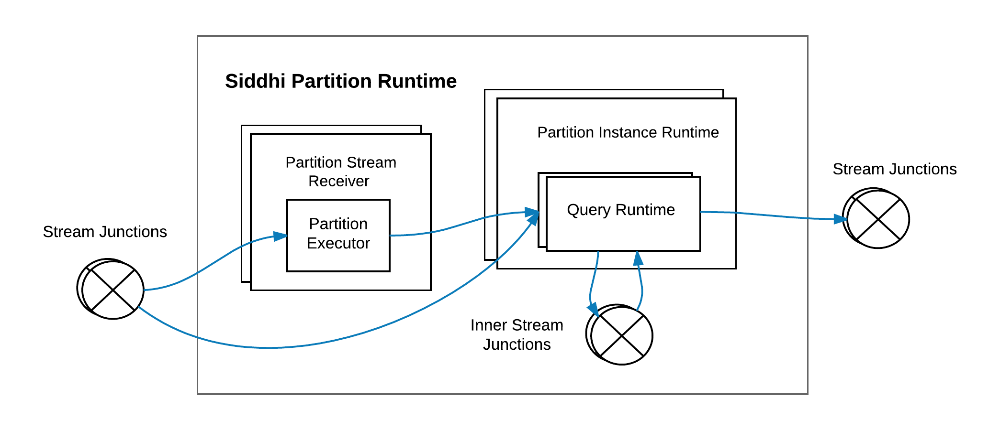

# Siddhi 4.x Architecture 

!!! info
    Please find the latest Siddhi Architecture [here](https://siddhi-io.github.io/siddhi/documentation/siddhi-5.x/architecture-5.x/)

Siddhi is a software library that can be utilized in any of the following ways:

- Run as a server on its own
- Run within WSO2 SP as a service
- Embedded into any Java or Python based application
- Run on an Android application
 
It provides analytical operators, orchestrates data flows, calculates analytics, and detects
patterns on event data from multiple disparate live data sources. This allows developers to build applications that collect data, 
analyze it, and communicate the results in real time.

This section illustrates the architecture of Siddhi and guides you through its key functionality. We hope this article 
helps developers to understand Siddhi and its codebase better, and also contribute to improve Siddhi by reporting and fixing bugs.

## Main Design Decisions

- Event by event processing of real-time streaming data to achieve low latency. 
- Ease of use with Streaming SQL providing an intuitive way to express stream processing logic and complex 
event processing constructs such as Patterns.  
- Achieve high performance by processing all events in-memory and by storing their states in-memory. 
- Optimizing performance by enforcing a strict schema for event streams and by pre-compiling the queries.
- Optimizing memory consumption by having only the absolutely necessary information in-memory and 
dropping the rest as soon as possible. 
- Supporting multiple extension points to accommodate a diverse set of functionality such as supporting multiple sources, sinks, functions, 
aggregation operations, windows, etc.

## High Level Architecture

 
At a high level, Siddhi consumes events from various events sources, processes them according to the defined Siddhi application, 
and produces results to the subscribed event sinks. 
Siddhi can store and consume events from in-memory tables or from external data stores such as `RDBMS`, `MongoDB`, 
`Hazelcast` in-memory grid, etc. (i.e., when configured to do so). Siddhi also allows applications and users to query Siddhi via its Store Query API to interactively 
retrieve data from its in-memory and other stores.
 
### Main Modules in Siddhi

Siddhi comprises four main modules, they are: 

- **[Siddhi Query API](https://github.com/siddhi-io/siddhi/tree/4.4.x/modules/siddhi-query-api)** : This allows you to define the execution logic of the Siddhi application as queries and definitions using POJO classes. 
Internally, Siddhi uses these objects to identify the tasks that it is expected to perform. 

- **[Siddhi Query Compiler](https://github.com/siddhi-io/siddhi/tree/4.4.x/modules/siddhi-query-compiler)** : This allows you to define the Siddhi application using the Siddhi Streaming SQL, 
 and then it converts the Streaming SQL script to Siddhi Query POJO Objects so that Siddhi can execute them. 
 
- **[Siddhi Core](https://github.com/siddhi-io/siddhi/tree/4.4.x/modules/siddhi-core)** : This builds the execution runtime based on the defined Siddhi Application and processes the events as and when they arrive. 
 
- **[Siddhi Annotation](https://github.com/siddhi-io/siddhi/tree/4.4.x/modules/siddhi-annotations)** : This is a helper module that allows all extensions to be annotated, so that they can be 
picked by Siddhi Core for processing. This also helps Siddhi to generate the extension documentation. 

## Siddhi Component Architecture 

The following diagram illustrates the main components of Siddhi and how they work together. 

 
Here the [Siddhi Core](https://github.com/wso2/siddhi/tree/master/modules/siddhi-core) module maintains
the execution logic. It also interacts with the external environment and systems 
for consuming and publishing events. To achieve these tasks, it uses the following components:  
 
- [SiddhiManager](https://github.com/wso2/siddhi/blob/master/modules/siddhi-core/src/main/java/io/siddhi/core/SiddhiManager.java) : 
  This is a key component of Siddhi Core that manages Siddhi Application Runtimes 
  and facilitates their functionality via Siddhi Context with periodic state persistence, statistics reporting and extension loading. 
   
- [SiddhiAppRuntime](https://github.com/wso2/siddhi/blob/master/modules/siddhi-core/src/main/java/io/siddhi/core/SiddhiAppRuntime.java) : 
 A Siddhi Application Runtime is generated for each Siddhi Application deployed. Siddhi Application Runtimes
 provide an isolated execution environment for each Siddhi Application defined.
 These Siddhi Application Runtimes are based on the logic of their Siddhi Application, and they consume and publish events from various external systems and Java or Python programmes. 
  
- [SiddhiContext](https://github.com/wso2/siddhi/blob/master/modules/siddhi-core/src/main/java/io/siddhi/core/config/SiddhiContext.java) : 
This is a shared object for all the Siddhi Application Runtimes within the Siddhi manager, and it contains references 
to the persistence store for periodic persistence, statistics manager to report performance statistics of Siddhi Application Runtimes, 
and extension holders for loading Siddhi extensions. 

## Siddhi Application Creation
 
Execution logic in Siddhi is composed as a Siddhi Application, and this is passed as a string to 
**SiddhiManager** to create the **SiddhiAppRuntime** for execution. 

When a Siddhi Application is passed to the `SiddhiManager.createSiddhiAppRuntime()`, it is processed internally with the 
[SiddhiCompiler](https://github.com/wso2/siddhi/blob/master/modules/siddhi-query-compiler/src/main/java/io/siddhi/query/compiler/SiddhiCompiler.java). 
Here, the **SiddhiApp** String is converted to [SiddhiApp](https://github.com/wso2/siddhi/blob/master/modules/siddhi-query-api/src/main/java/io/siddhi/query/api/SiddhiApp.java)
 object model by the [SiddhiQLBaseVisitorImpl](https://github.com/wso2/siddhi/blob/master/modules/siddhi-query-compiler/src/main/java/io/siddhi/query/compiler/internal/SiddhiQLBaseVisitorImpl.java) class. 
The model is then passed to the [SiddhiAppParser](https://github.com/wso2/siddhi/blob/master/modules/siddhi-core/src/main/java/io/siddhi/core/util/parser/SiddhiAppParser.java) 
for the **SiddhiAppRuntime** creation.

## Siddhi App Execution Flow

Following diagram depicts the execution flow within a Siddhi App Runtime. 

 
The path taken by events within Siddhi is indicated in blue. 

The components that are involved in handling the events are as follows: 

- [StreamJunction](https://github.com/wso2/siddhi/blob/master/modules/siddhi-core/src/main/java/io/siddhi/core/stream/StreamJunction.java)
    
    This routes events to various components within the Siddhi App Runtime. A stream junction is
    generated for each stream defined or inferred in the Siddhi Application. A stream junction by default uses the incoming event's thread
    for processing subscribed components, but it can also be configured via the `@Async` annotation to buffer the events and 
    use a different thread for subsequent execution.
    
- [InputHandler](https://github.com/wso2/siddhi/blob/master/modules/siddhi-core/src/main/java/io/siddhi/core/stream/input/InputHandler.java) 
    
    An instance of input handler is created for each stream junction, and this is used for pushing `Event` and
     `Event[]` objects into stream junctions from sources, and Java/Python programmes. 
    
- [StreamCallback](https://github.com/wso2/siddhi/blob/master/modules/siddhi-core/src/main/java/io/siddhi/core/stream/output/StreamCallback.java) 

    This receives `Event[]`s from stream junction and passes them to sinks to publish to external endpoints, 
    or passes them to subscribed Java/Python programmes for further processing. 
    
- [Queries](https://github.com/wso2/siddhi/blob/master/modules/siddhi-core/src/main/java/io/siddhi/core/query/QueryRuntime.java) & [Partitions](https://github.com/wso2/siddhi/blob/master/modules/siddhi-core/src/main/java/io/siddhi/core/partition/PartitionRuntime.java) 

    These components process the events by filtering, transforming, joining, patten matching, 
    etc. They consume events from one or more stream junctions, process them and publish the processed events 
    into stream junctions based on the defined query or partition. 
     
- [Source](https://github.com/wso2/siddhi/blob/master/modules/siddhi-core/src/main/java/io/siddhi/core/stream/input/source/Source.java) 
    
    Sources consume events from external sources in various data formats, convert them into Siddhi events
    and pass them to corresponding Stream Junctions via their Input Handlers. A source is generated 
    for each `@Source` annotation defined above a stream definition. Each source consumes events from an external source in the data format configured for it. 
    
- [SourceMapper](https://github.com/wso2/siddhi/blob/master/modules/siddhi-core/src/main/java/io/siddhi/core/stream/input/source/SourceMapper.java) 

    A source mapper needs to be configured for each source in order to convert the format of each incoming event to that of a Siddhi event. 
    The source mapper type can be configured using the `@Map` annotation within the `@Source` annotation. When the `@Map` annotation is
    not defined, Siddhi uses the [PassThroughSourceMapper](https://github.com/wso2/siddhi/blob/master/modules/siddhi-core/src/main/java/io/siddhi/core/stream/input/source/PassThroughSourceMapper.java),
    where it assumes that the incoming message is already in the Siddhi Event format, and therefore makes no changes to the event format.
    
- [Sink](https://github.com/wso2/siddhi/blob/master/modules/siddhi-core/src/main/java/io/siddhi/core/stream/output/sink/Sink.java) 

    Sinks convert the Siddhi Events to various data formats and publish them to external endpoints. 
    A Sink generated for each `@Sink` annotation defined above a stream definition to publish the events arriving 
    to that stream. 
    
- [SinkMapper](https://github.com/wso2/siddhi/blob/master/modules/siddhi-core/src/main/java/io/siddhi/core/stream/output/sink/SinkMapper.java)

    A sink mapper is configured for each Sink in order to map the Siddhi events to the specified data format so that they 
    can be published via the sink. The sink mapper type can be configured using the `@Map` annotation within the `@Sink`
    annotation. When the `@Map` annotation is not defined, Siddhi uses [PassThroughSinkMapper](https://github.com/wso2/siddhi/blob/master/modules/siddhi-core/src/main/java/io/siddhi/core/stream/output/sink/PassThroughSinkMapper.java), 
    where it  passes the Siddhi events in the existing format (i.e., the Siddhi event format) to the Sink.
    
- [Table](https://github.com/wso2/siddhi/blob/master/modules/siddhi-core/src/main/java/io/siddhi/core/table/Table.java)
    
    Tables store events. By default, Siddhi uses the [InMemoryTable](https://github.com/wso2/siddhi/blob/master/modules/siddhi-core/src/main/java/io/siddhi/core/table/InMemoryTable.java) 
    implementation to store events in-memory. When `@Store` annotation
    is used, it loads the associated Table implementation based on the defined `store` type. Most table implementations are 
    extended from the [AbstractRecordTable](https://github.com/wso2/siddhi/blob/master/modules/siddhi-core/src/main/java/io/siddhi/core/table/record/AbstractRecordTable.java) 
    abstract class for ease of development.
    
- [Window](https://github.com/wso2/siddhi/blob/master/modules/siddhi-core/src/main/java/io/siddhi/core/window/Window.java)
    
    Windows store events and determine when events can be considered expired based on the given window constrain. Multiple types of windows are
    can be implemented by extending the [WindowProcessor](https://github.com/wso2/siddhi/blob/master/modules/siddhi-core/src/main/java/io/siddhi/core/query/processor/stream/window/WindowProcessor.java) 
    abstract class. 
    
- [IncrementalAggregation](https://github.com/wso2/siddhi/blob/master/modules/siddhi-core/src/main/java/io/siddhi/core/query/selector/attribute/aggregator/incremental/IncrementalAggregationProcessor.java) 

    This allows you to obtain aggregates in an incremental manner for a specified set of time periods.
    Incremental aggregation functions can be implemented by extending [IncrementalAttributeAggregator](https://github.com/wso2/siddhi/blob/master/modules/siddhi-core/src/main/java/io/siddhi/core/query/selector/attribute/aggregator/incremental/IncrementalAttributeAggregator.java). 
     
- [Trigger](https://github.com/wso2/siddhi/blob/master/modules/siddhi-core/src/main/java/io/siddhi/core/trigger/Trigger.java)
 
    A trigger triggers events at a given interval to the stream junction that has the same name as the trigger.
    
- [QueryCallback](https://github.com/wso2/siddhi/blob/master/modules/siddhi-core/src/main/java/io/siddhi/core/query/output/callback/QueryCallback.java)

    A query callback receives notifications when events are emitted from queries. Then it notifies the event occurrence `timestamp`, and classifies 
    the events into `currentEvents`, and `expiredEvents`. 
    

## Siddhi Query Execution 

Siddhi [QueryRuntimes](https://github.com/wso2/siddhi/blob/master/modules/siddhi-core/src/main/java/io/siddhi/core/query/QueryRuntime.java)
 can be categorized in to three main types: 
  
* [SingleInputStream](https://github.com/wso2/siddhi/blob/master/modules/siddhi-query-api/src/main/java/io/siddhi/query/api/execution/query/input/stream/SingleInputStream.java): 
 Queries that consist of query types such as filters and windows.
 
* [JoinInputStream](https://github.com/wso2/siddhi/blob/master/modules/siddhi-query-api/src/main/java/io/siddhi/query/api/execution/query/input/stream/JoinInputStream.java):
  Queries that consist of joins.
  
* [StateInputStream](https://github.com/wso2/siddhi/blob/master/modules/siddhi-query-api/src/main/java/io/siddhi/query/api/execution/query/input/stream/StateInputStream.java): 
   Queries that consist of patterns and sequences. 

Following section explains the internals of each query type. 

### [SingleInputStream](https://github.com/wso2/siddhi/blob/master/modules/siddhi-query-api/src/main/java/io/siddhi/query/api/execution/query/input/stream/SingleInputStream.java) Query Runtime (Filter & Windows)

")
 
A single input stream query runtime is generated for filter and window queries. They consume events from a stream junction or a window
and convert the incoming events according to the expected output stream format at the [ProcessStreamReceiver](https://github.com/wso2/siddhi/blob/master/modules/siddhi-core/src/main/java/io/siddhi/core/query/input/ProcessStreamReceiver.java)
by dropping all the unrelated incoming stream attributes.

Then the converted events are passed through a few Processors such as [FilterProcessor](https://github.com/wso2/siddhi/blob/master/modules/siddhi-core/src/main/java/io/siddhi/core/query/processor/filter/FilterProcessor.java),
[StreamProcessor](https://github.com/wso2/siddhi/blob/master/modules/siddhi-core/src/main/java/io/siddhi/core/query/processor/stream/StreamProcessor.java), 
[StreamFunctionProcessor](https://github.com/wso2/siddhi/blob/master/modules/siddhi-core/src/main/java/io/siddhi/core/query/processor/stream/function/StreamFunctionProcessor.java), 
[WindowProcessor](https://github.com/wso2/siddhi/blob/master/modules/siddhi-core/src/main/java/io/siddhi/core/query/processor/stream/window/WindowProcessor.java)
 and [QuerySelector](https://github.com/wso2/siddhi/blob/master/modules/siddhi-core/src/main/java/io/siddhi/core/query/selector/QuerySelector.java). 
Here, the `StreamProcessor`, `StreamFunctionProcessor`, and `WindowProcessor` can be extended with 
various stream processing capabilities. The last processor of the chain of processors must always be a `QuerySelector`, and each chain can 
have only one `WindowProcessor`. When the query runtime consumes events from a window, its chain of processors cannot 
contain a `WindowProcessor`.

The `FilterProcessor` is implemented with an [ExpressionExecutor](https://github.com/wso2/siddhi/blob/master/modules/siddhi-core/src/main/java/io/siddhi/core/executor/ExpressionExecutor.java) 
that returns a boolean value. Expressions have a tree structure, and 
they are processed based on the Depth First Search algorithm. To achieve high performance,  Siddhi currently depends on the user
to formulate the least successful case in the leftmost side of the condition, thereby increasing the chance of an early `false` detection.

The condition expression `price >= 100 and ( Symbol == 'IBM' or Symbol == 'MSFT' )` is represented as shown below.

")

These expressions also support the execution of user defined functions (UDFs), and they can be implemented by extending the [FunctionExecutor](https://github.com/wso2/siddhi/blob/master/modules/siddhi-core/src/main/java/io/siddhi/core/executor/function/FunctionExecutor.java) class. 

After getting processed by each processor, each event reaches the `QuerySelector` for transformation. At the `QuerySelector`,
events are transformed based on the `select` clause of the query. If there is a `Group By` defined, then the [GroupByKeyGenerator](https://github.com/wso2/siddhi/blob/master/modules/siddhi-core/src/main/java/io/siddhi/core/query/selector/GroupByKeyGenerator.java)
identifies the group by key, and then each [AttributeProcessor](https://github.com/wso2/siddhi/blob/master/modules/siddhi-core/src/main/java/io/siddhi/core/query/selector/attribute/processor/AttributeProcessor.java)
is executed based on that group-by key. `AttributeProcessors` can contain any expression including 
constant values, variables and user defined functions. They can also contain [AttributeAggregator](https://github.com/wso2/siddhi/blob/master/modules/siddhi-core/src/main/java/io/siddhi/core/query/selector/attribute/aggregator/AttributeAggregator.java)s
for processing aggregation operations such as `sum`, `count`, etc. Here, an `AttributeAggregator` is generated to 
keep track of the aggregation state. When it becomes obsolete, it is destroyed. The events are transformed to the expected output format through this operation.  
 
After an event is transformed to the output format, it is evaluated against the `HavingConditionExecutor` if a `having` clause is 
provided. Only the succeeding events are pushed to the `OutputRateLimiter`.   

At `OutputRateLimiter`, the event output is controlled before sending the events to the stream junction or to the query callback. 
When the `output` clause is not defined, the `PassThroughOutputRateLimiter` is used by passing all the events without any rate limiting. 

#### Temporal Processing with Windows

The temporal event processing aspect is achieved via [Window](https://github.com/wso2/siddhi/blob/master/modules/siddhi-core/src/main/java/io/siddhi/core/window/Window.java)
and [AttributeAggregators](https://github.com/wso2/siddhi/blob/master/modules/siddhi-core/src/main/java/io/siddhi/core/query/selector/attribute/aggregator/AttributeAggregator.java)

To achieve temporal processing,Siddhi uses the following four type of events: 

* **Current Events**: Events that are newly arriving to a query from streams.

* **Expired Events**: Events that have expired from a window. 

* **Timer Events**: Events that inform the query about an update of execution time. These events are usually generated by schedulers. 
 
* **Reset Events**: Events that resets the Siddhi query states.
 
In Siddhi, when an event comes into a [WindowProcessor](https://github.com/wso2/siddhi/blob/master/modules/siddhi-core/src/main/java/io/siddhi/core/query/processor/stream/window/WindowProcessor.java), 
it creates an appropriate expired event corresponding to the incoming current event with the expiring timestamp, and stores that 
event in the window. The `WindowProcessor`  also forwards the current event to the next processor for further processing. 
It uses a scheduler or such to determine when to emit the events it has in memory. During that time, it emits these events as expired events. If it needs to emit all the events in the memory at once, it emits a single reset event instead of sending one expired event for each event it has stored, so that it can reset the states in one go. For each current event emitted from a window, a corresponding expired event must be emitted. If not, a common reset event must be emitted.  
This is vital in Siddhi because Siddhi relies on these events to calculate the Aggregations at the `QuerySelector`. 
In the `QuerySelector`, the arrived current events increase the aggregation values, expired events decrease the values, and 
reset events reset the aggregation calculation.

For example, the sliding [TimeWindow](https://github.com/wso2/siddhi/blob/master/modules/siddhi-core/src/main/java/io/siddhi/core/query/processor/stream/window/TimeWindowProcessor.java)
creates a corresponding expired event for each current event that arrives,  adds that to 
the window, adds an entry to the scheduler to notify when that event need to be expired by sending it a timer event, and 
finally sends the current event to the next processor for subsequent processing.  
When the window receives an indication that the expected expiry time has come for the oldest event in the window via a 
a timer event or other means, it removes the expired event from the window and passes that to the next processor. 

### [JoinInputStream](https://github.com/wso2/siddhi/blob/master/modules/siddhi-query-api/src/main/java/io/siddhi/query/api/execution/query/input/stream/JoinInputStream.java) Query Runtime (Join)
 

 
Join input stream query runtime is generated for join queries. This can consume events from two stream junctions and perform a join operation as depicted above. 
It can also perform a join by consuming events from one stream junction and join against itself, or it can join against a 
table, window or an incremental aggregation. When a join is performed with a table, window or incremental aggregation,
the `WindowProcessor` in the image is replaced with the table, window or incremental aggregation. No basic processors are used on their side. 

The joining operation is triggered by the events that arrive from the stream junction.
Here, when an event from one stream reaches the pre `JoinProcessor`, it matches against all the available events of the other stream's `WindowProcessor`. 
When a match is found, those matched events are sent to the `QuerySelector` as current events, and at the same time, 
the original event is added to the `WindowProcessor` where it remains until it expires. Similarly, when an 
event expires from the `WindowProcessor`, it matches against all the available events of the other stream's `WindowProcessor`, and 
when a match is found, those matched events are sent to the `QuerySelector` as expired events.

Note: Despite the optimizations, a join query is quite expensive when it comes to performance. This is because
 the `WindowProcessor` is locked during the matching process to avoid race conditions and to achieve accuracy while 
 joining. Therefore, avoid matching large windows in high volume streams. Based on the scenario, 
 using appropriate window sizes (by time or length) helps to achieve maximum performance.
 
### [StateInputStream](https://github.com/wso2/siddhi/blob/master/modules/siddhi-query-api/src/main/java/io/siddhi/query/api/execution/query/input/stream/StateInputStream.java) Query Runtime (Pattern & Sequence)

")

The state input stream query runtime is generated for pattern and sequence queries. This consumes events from one or more stream junctions 
via `ProcessStreamReceivers`. A `ProcessStreamReceiver` and a set of basic processors is defined in the query for each condition.
When a `ProcessStreamReceiver` consumes the events, it updates the states with the incoming events that are generated by previous conditions. If the condition applied
is the first condition in the query, then it creates a new state and updates that with the incoming event. This is then passed 
to basic processors to perform filtering and transformation operations. The states 
that pass the basic processors are consumed by the `PostStateProcessor` and stored at the `PreStateProcessor` of the following pattern or 
sequence condition. When the state reaches the final condition's `PostStateProcessor`, 
the output event is generated and emitted by `QuerySelector`. 

## Siddhi Partition Execution 

A partition is a wrapper around one or more Siddhi queries and inner streams that connect them. 
A partition is implemented in Siddhi as a [PartitionRuntime](https://github.com/wso2/siddhi/blob/master/modules/siddhi-core/src/main/java/io/siddhi/core/partition/PartitionRuntime.java),
and each unique partition instance is implemented as a [PartitionInstanceRuntime](https://github.com/wso2/siddhi/blob/master/modules/siddhi-core/src/main/java/io/siddhi/core/partition/PartitionInstanceRuntime.java)
Each partitioned stream entering the partition
goes through the appropriate [PartitionStreamReceiver](https://github.com/wso2/siddhi/blob/master/modules/siddhi-core/src/main/java/io/siddhi/core/partition/PartitionStreamReceiver.java).
The [PartitionExecutor](https://github.com/wso2/siddhi/blob/master/modules/siddhi-core/src/main/java/io/siddhi/core/partition/executor/PartitionExecutor.java)
 of stream receiver evaluates   
the incoming events to identify the partition key using the [RangePartitionExecutor](https://github.com/wso2/siddhi/blob/master/modules/siddhi-core/src/main/java/io/siddhi/core/partition/executor/RangePartitionExecutor.java)
 or the [ValuePartitionExecutor](https://github.com/wso2/siddhi/blob/master/modules/siddhi-core/src/main/java/io/siddhi/core/partition/executor/ValuePartitionExecutor.java),
  and passes 
the events to the `QueryRuntimes` of the appropriate `PartitionInstanceRuntime` based on the partition key. 
If a `PartitionInstanceRuntime` is not available for the given partition key, it is dynamically generated via the relevant `QueryRuntimes` and `InnerStreamJunctions`. 
  
Based on the partition definition, the `QueryRuntimes` in the `PartitionInstanceRuntime` wire themselves via inner `StreamJunctions` or using 
`StreamJunctions` outside the partitions. 
When a partition query consumes a non partitioned global stream, all instances of its `QueryRuntime` that are part of multiple `PartitionInstanceRuntimes`
receive the same event as depicted in the above diagram. 

## Siddhi Event Formats

Siddhi has three event formats. 

- [Event](https://github.com/wso2/siddhi/blob/master/modules/siddhi-core/src/main/java/io/siddhi/core/event/Event.java) 

    This is the format exposed to end users when they send events via Input Handler, and consume events via Stream Callback or Query Callback.
    This consists of an `Object[]` that contains all the values in accordance to the corresponding stream. 
     
- [StreamEvent](https://github.com/wso2/siddhi/blob/master/modules/siddhi-core/src/main/java/io/siddhi/core/event/stream/StreamEvent.java) (Subtype of [ComplexEvent](https://github.com/wso2/siddhi/blob/master/modules/siddhi-core/src/main/java/io/siddhi/core/event/ComplexEvent.java))

    This is used within queries. This contains the following three `Object[]`s: 
    - `beforeWindowData`: This contains values that are only used in processors that are executed before the `WindowProcessor`.
    - `onAfterWindowData`: This contains values that are only used by the `WindowProcessor` and the other processors that follow it, but not sent as output.
    - `outputData`: This contains the values that comply with the output stream of the query.
  
   In order to optimize the amount of data that is stored in the in-memory at windows, the content in `beforeWindowData` is cleared before the 
    event enters the `WindowProcessor`. StreamEvents can also be chained by linking each other via the `next` property in them.  
    
- [StateEvent](https://github.com/wso2/siddhi/blob/master/modules/siddhi-core/src/main/java/io/siddhi/core/event/state/StateEvent.java) (Subtype of [ComplexEvent](https://github.com/wso2/siddhi/blob/master/modules/siddhi-core/src/main/java/io/siddhi/core/event/ComplexEvent.java))

    This is used in Joins, Patterns and Sequences when we need to associate events of multiple streams, tables, windows and aggregations of different types together.
    This has a collection of `StreamEvents` representing different streams, tables, etc, that are used in the query, and `outputData` to contain the values that are needed for the query output. 
    `StreamEvents` can also be chained by linking each other with the `next` property in them. 
    
**Event Chunks**

Event Chunks provide an easier way of manipulating the chain of `StreamEvents` and `StateEvents` so that they are be easily iterated, inserted and removed. 

## Summary 

This article focuses on describing the architecture of Siddhi and rationalizing the architectural decisions made. It
also explains the key features of Siddhi.  
This is possibly a great starting point for new developers to understand Siddhi and to start contributing to it.
