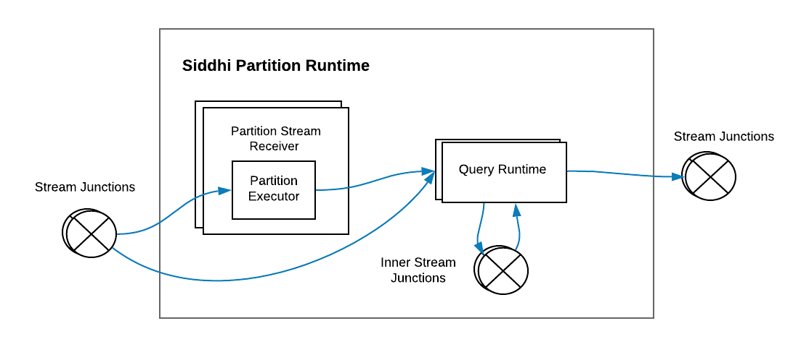
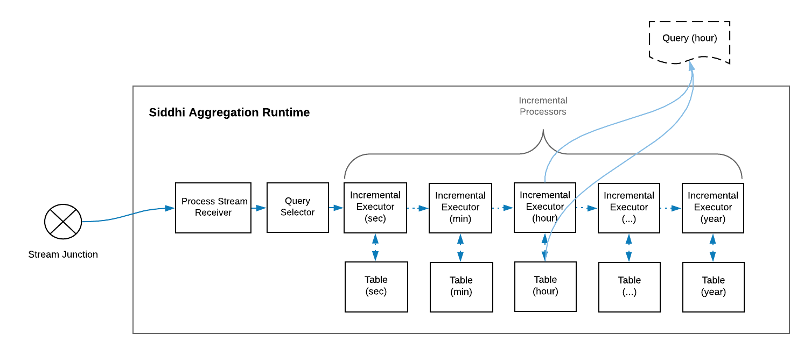

# Siddhi 5.x Architecture 

Siddhi is an open source, cloud native, stream processing and complex event processing engine, and it can be utilized in any of the following ways:

- Run as a server on its own
- Run with [WSO2 Stream Processor](https://wso2.com/analytics-and-stream-processing/) as a service
- Embedded into any Java or Python based application
- Run on an Android application
 
Siddhi provides streaming data integration and data analytical operators. It connects multiple disparate live data sources, 
orchestrates data flows, calculates analytics, and also detects complex event patterns. This allows developers to build 
applications that collect data, performs data transformation and analytics, and publish the results to data sinks in real time.

!!! info
    Please find the Siddhi 4.x Architecture [here](https://siddhi-io.github.io/siddhi/documentation/siddhi-4.x/architecture-4.x/)

This section illustrates the architecture of Siddhi Engine and guides you through its key functionality. We hope this article 
helps developers to understand Siddhi and its codebase better, and also help them to contribute and improve Siddhi.

## Main Design Decisions

- Event by event processing of real-time streaming data to achieve low latency. 
- Ease of use with Streaming SQL providing an intuitive way to express stream processing logic and complex 
event processing constructs such as Patterns. 
- Achieve high performance by processing events in-memory and using data stores for long term data storage. 
- Optimize performance by enforcing a strict event stream schema and by pre-compiling the queries.
- Optimize memory consumption by having only the absolutely necessary information in-memory and dropping the rest as soon as possible. 
- Supporting multiple extension points to accommodate a diverse set of functionality such as supporting multiple sources, sinks, functions, 
aggregation operations, windows, etc.

## High Level Architecture

 
At a high level, Siddhi consumes events from various events sources, processes them according to the defined Siddhi application, 
and produces results to the subscribed event sinks. 
Siddhi can store and consume events from in-memory tables or from external data stores such as `RDBMS`, `MongoDB`, 
`Hazelcast` in-memory grid, etc. (i.e., when configured to do so). Siddhi also allows applications and users to query Siddhi via its Store Query API to interactively 
retrieve data from in-memory and other stores.
 
### Main Modules in Siddhi Engine

Siddhi Engine comprises four main modules, they are: 

- **[Siddhi Query API](https://github.com/wso2/siddhi/tree/master/modules/siddhi-query-api)** : This allows users to define the execution logic of the Siddhi application as queries and definitions using POJOs (Plan Old Java Objects). 
Internally, Siddhi uses these objects to identify the logic that it is expected to perform. 

- **[Siddhi Query Compiler](https://github.com/wso2/siddhi/tree/master/modules/siddhi-query-compiler)** : This allows users to define the Siddhi application using the Siddhi Streaming SQL, 
 and it compiles the Streaming SQL script to Siddhi Query API POJOs so that Siddhi can execute them. 
 
- **[Siddhi Core](https://github.com/wso2/siddhi/tree/master/modules/siddhi-core)** : This builds the execution runtime based on the defined Siddhi Application POJOs and processes the incoming events as and when they arrive. 
 
- **[Siddhi Annotation](https://github.com/wso2/siddhi/tree/master/modules/siddhi-annotations)** : This is a helper module that allows all extensions to be annotated, so that they can be 
picked by Siddhi Core for processing. This also helps Siddhi to generate the extension documentation. 

## Siddhi Component Architecture 

The following diagram illustrates the main components of Siddhi and how they work together. 

 
Here the [Siddhi Core](https://github.com/wso2/siddhi/tree/master/modules/siddhi-core) module maintains
the execution logic. It also interacts with the external environment and systems 
for consuming, processing and publishing events. It uses the following components achieve its tasks:  
 
- [SiddhiManager](https://github.com/wso2/siddhi/blob/master/modules/siddhi-core/src/main/java/io/siddhi/core/SiddhiManager.java) : 
  This is a key component of Siddhi Core that manages Siddhi Application Runtimes 
  and facilitates their functionality via Siddhi Context with periodic state persistence, 
  statistics reporting and extension loading. It is recommended to use one Siddhi Manager for a single JVM.  
   
- [SiddhiAppRuntime](https://github.com/wso2/siddhi/blob/master/modules/siddhi-core/src/main/java/io/siddhi/core/SiddhiAppRuntime.java) : 
 Siddhi Application Runtime can be generated for each Siddhi Application through the Siddhi Manager. Siddhi Application Runtimes
 provide an isolated execution environment for each defined Siddhi Application. These Siddhi Application Runtimes can have their one lifecycle and they execute 
 based on the logic defined in their Siddhi Application. 
  
- [SiddhiContext](https://github.com/wso2/siddhi/blob/master/modules/siddhi-core/src/main/java/io/siddhi/core/config/SiddhiContext.java) : 
This is a shared object across all the Siddhi Application Runtimes within the same Siddhi manager. It contains references 
to the persistence store for periodic persistence, statistics manager to report performance statistics of Siddhi Application Runtimes, 
and extension holders for loading Siddhi extensions. 

## Siddhi Application Creation
 
Execution logic if the Siddhi Engine is composed as a Siddhi Application, and this is usually passed as a string to 
**SiddhiManager** to create the **SiddhiAppRuntime** for execution. 

When a Siddhi Application is passed to the `SiddhiManager.createSiddhiAppRuntime()`, it is processed internally with the 
[SiddhiCompiler](https://github.com/wso2/siddhi/blob/master/modules/siddhi-query-compiler/src/main/java/io/siddhi/query/compiler/SiddhiCompiler.java). 
Here, the **SiddhiApp** String is compiled to [SiddhiApp](https://github.com/wso2/siddhi/blob/master/modules/siddhi-query-api/src/main/java/io/siddhi/query/api/SiddhiApp.java)
 object model by the [SiddhiQLBaseVisitorImpl](https://github.com/wso2/siddhi/blob/master/modules/siddhi-query-compiler/src/main/java/io/siddhi/query/compiler/internal/SiddhiQLBaseVisitorImpl.java) class. 
 This validates the syntax of the given Siddhi Application. The model is then passed to the [SiddhiAppParser](https://github.com/wso2/siddhi/blob/master/modules/siddhi-core/src/main/java/io/siddhi/core/util/parser/SiddhiAppParser.java) 
to create the **SiddhiAppRuntime**. During this phase the semantics of the Siddhi Application is validated and the execution logic of the Siddhi Application is optimized. 

## Siddhi App Execution Flow

Following diagram depicts the execution flow within a Siddhi App Runtime. 

 
The path taken by events within Siddhi Engine is indicated in blue. 

The components that are involved in handling the events are following: 

- [StreamJunction](https://github.com/wso2/siddhi/blob/master/modules/siddhi-core/src/main/java/io/siddhi/core/stream/StreamJunction.java)
    
    This routes events of a particular stream to various components within the Siddhi App Runtime. A stream junction is
    generated for each defined or inferred Stream in the Siddhi Application. A stream junction by default uses the incoming event's thread
    and passes all the events to its subscribed components as soon as they arrive, but this behaviour can be altered by configuring `@Async` 
    annotation to buffer the events at the and stream junction and to use another one or more threads to collect the events from the buffer 
    and process the subsequent executions.
    
- [InputHandler](https://github.com/wso2/siddhi/blob/master/modules/siddhi-core/src/main/java/io/siddhi/core/stream/input/InputHandler.java) 
    
    Input handler is used to push `Event` and `Event[]` objects into stream junctions from defined event sources, and from Java/Python programmes. 
    
- [StreamCallback](https://github.com/wso2/siddhi/blob/master/modules/siddhi-core/src/main/java/io/siddhi/core/stream/output/StreamCallback.java) 

    This receives `Event[]`s from stream junction and passes them to event sinks to publish to external endpoints, 
    and/or passes them to subscribed Java/Python programmes for further processing. 
    
- [Queries](https://github.com/wso2/siddhi/blob/master/modules/siddhi-core/src/main/java/io/siddhi/core/query/QueryRuntime.java) & [Partitions](https://github.com/wso2/siddhi/blob/master/modules/siddhi-core/src/main/java/io/siddhi/core/partition/PartitionRuntime.java) 

    These components process events by filtering, transforming, aggregation, joining, patten matching, 
    etc. They consume events from one or more stream junctions, process them and publish the processed events
    into a set of stream junctions based on the defined queries or partitions. 
     
- [Source](https://github.com/wso2/siddhi/blob/master/modules/siddhi-core/src/main/java/io/siddhi/core/stream/input/source/Source.java) 
    
    Sources consume events from external sources in various data formats, convert them into Siddhi events using [SourceMapper](https://github.com/wso2/siddhi/blob/master/modules/siddhi-core/src/main/java/io/siddhi/core/stream/input/source/SourceMapper.java)s 
    and pass them to corresponding stream junction via their associated input handlers. A source is generated 
    for each `@Source` annotation defined above a stream definition. 
    
- [SourceMapper](https://github.com/wso2/siddhi/blob/master/modules/siddhi-core/src/main/java/io/siddhi/core/stream/input/source/SourceMapper.java) 

    A source mapper is a sub component of source, and it needs to be configured for each source in order to convert the incoming event into Siddhi event. 
    The source mapper type can be configured using the `@Map` annotation within the `@Source` annotation. When the `@Map` annotation is
    not defined, Siddhi uses the [PassThroughSourceMapper](https://github.com/wso2/siddhi/blob/master/modules/siddhi-core/src/main/java/io/siddhi/core/stream/input/source/PassThroughSourceMapper.java),
    where it assumes that the incoming message is already in the [Siddhi Event](https://github.com/siddhi-io/siddhi/blob/master/modules/siddhi-core/src/main/java/io/siddhi/core/event/Event.java) 
    format (i.e `Event` or `Event[]`), and therefore makes no changes to the incoming event format.
    
- [Sink](https://github.com/wso2/siddhi/blob/master/modules/siddhi-core/src/main/java/io/siddhi/core/stream/output/sink/Sink.java) 

    Sinks consumes events from its associated stream junction, convert them to various data formats via [SinkMapper](https://github.com/wso2/siddhi/blob/master/modules/siddhi-core/src/main/java/io/siddhi/core/stream/output/sink/SinkMapper.java) 
    and publish them to external endpoints as defined in the `@Sink` annotation. A sink is generated for each `@Sink` annotation defined above a stream definition. 
    
- [SinkMapper](https://github.com/wso2/siddhi/blob/master/modules/siddhi-core/src/main/java/io/siddhi/core/stream/output/sink/SinkMapper.java)

    A sink mapper is a sub component of sink. and its need to be configured for each sink in order to map the Siddhi events to the specified data format so that they 
    can be published via the sink. The sink mapper type can be configured using the `@Map` annotation within the `@Sink`
    annotation. When the `@Map` annotation is not defined, Siddhi uses [PassThroughSinkMapper](https://github.com/wso2/siddhi/blob/master/modules/siddhi-core/src/main/java/io/siddhi/core/stream/output/sink/PassThroughSinkMapper.java), 
    where it passes the [Siddhi Event](https://github.com/siddhi-io/siddhi/blob/master/modules/siddhi-core/src/main/java/io/siddhi/core/event/Event.java) 
    (i.e `Event` or `Event[]`) without any formatting to the Sink.
    
- [Table](https://github.com/wso2/siddhi/blob/master/modules/siddhi-core/src/main/java/io/siddhi/core/table/Table.java)
    
    Tables are used to store events. When tables are defined by default, Siddhi uses the [InMemoryTable](https://github.com/wso2/siddhi/blob/master/modules/siddhi-core/src/main/java/io/siddhi/core/table/InMemoryTable.java) 
    implementation to store events in-memory. When `@Store` annotation
    is used on top of the table definition, it loads the associated external data store connector based on the defined `store` type. Most table implementations are 
    extended from either [AbstractRecordTable](https://github.com/wso2/siddhi/blob/master/modules/siddhi-core/src/main/java/io/siddhi/core/table/record/AbstractRecordTable.java) 
    or [AbstractQueryableRecordTable](https://github.com/siddhi-io/siddhi/blob/master/modules/siddhi-core/src/main/java/io/siddhi/core/table/record/AbstractQueryableRecordTable.java) abstract classes
    the former provides functionality to query external data store based on a given filtering condition, and the latter queries external data store by providing projection, limits, and ordering parameters in addition to data filter condition.
    
- [Window](https://github.com/wso2/siddhi/blob/master/modules/siddhi-core/src/main/java/io/siddhi/core/window/Window.java)
    
    Windows store events as and when they arrive and automatically expire/clean them based on the given window constrain. Multiple types of windows are
    can be implemented by extending the [WindowProcessor](https://github.com/wso2/siddhi/blob/master/modules/siddhi-core/src/main/java/io/siddhi/core/query/processor/stream/window/WindowProcessor.java) 
    abstract class. 
    
- [IncrementalAggregation](https://github.com/wso2/siddhi/blob/master/modules/siddhi-core/src/main/java/io/siddhi/core/query/selector/attribute/aggregator/incremental/IncrementalAggregationProcessor.java) 

    Long running time series aggregates defined via the aggregation definition is calculated in an incremental manner using the Incremental Aggregation Processor for the defined time periods.
    Incremental aggregation functions can be implemented by extending [IncrementalAttributeAggregator](https://github.com/wso2/siddhi/blob/master/modules/siddhi-core/src/main/java/io/siddhi/core/query/selector/attribute/aggregator/incremental/IncrementalAttributeAggregator.java). 
    By default, incremental aggregations aggregate all the values in-memory, but when its associated with a store by adding `@store` 
    annotation it uses in-memory to aggregate partial results and use data stores to persist those increments. When requested for aggregate results it 
    retrieves data from data stores and (if needed from) in-memory, computes combined aggregate results and provide as the output. 
     
- [Trigger](https://github.com/wso2/siddhi/blob/master/modules/siddhi-core/src/main/java/io/siddhi/core/trigger/Trigger.java)
 
    A trigger triggers events at a given interval as given in the trigger definition. The triggered events are pushed to a stream junction having the same name as the trigger.
    
- [QueryCallback](https://github.com/wso2/siddhi/blob/master/modules/siddhi-core/src/main/java/io/siddhi/core/query/output/callback/QueryCallback.java)

    A query callback taps in to the events that are emitted by a particular query. It notifies the event occurrence `timestamp`, and classifies 
    the output events into `currentEvents`, and `expiredEvents`. 
    

## Siddhi Query Execution 

Siddhi [QueryRuntimes](https://github.com/wso2/siddhi/blob/master/modules/siddhi-core/src/main/java/io/siddhi/core/query/QueryRuntime.java)
 can be categorized in to three main types: 
  
* [SingleInputStream](https://github.com/wso2/siddhi/blob/master/modules/siddhi-query-api/src/main/java/io/siddhi/query/api/execution/query/input/stream/SingleInputStream.java): 
 Queries that consist of query types such as filters and windows.
 
* [JoinInputStream](https://github.com/wso2/siddhi/blob/master/modules/siddhi-query-api/src/main/java/io/siddhi/query/api/execution/query/input/stream/JoinInputStream.java):
  Queries that consist of joins.
  
* [StateInputStream](https://github.com/wso2/siddhi/blob/master/modules/siddhi-query-api/src/main/java/io/siddhi/query/api/execution/query/input/stream/StateInputStream.java): 
   Queries that consist of patterns and sequences. 

Following section explains the internals of each query type. 

### [SingleInputStream](https://github.com/wso2/siddhi/blob/master/modules/siddhi-query-api/src/main/java/io/siddhi/query/api/execution/query/input/stream/SingleInputStream.java) Query Runtime (Filter & Windows)

")
 
A single input stream query runtime is generated for filter and window queries. They consume events from a stream junction or a window
and convert the incoming events according to the expected output stream format at the [ProcessStreamReceiver](https://github.com/wso2/siddhi/blob/master/modules/siddhi-core/src/main/java/io/siddhi/core/query/input/ProcessStreamReceiver.java)
by dropping all the unrelated incoming stream attributes.

Then the converted events are passed through a few Processors such as [FilterProcessor](https://github.com/wso2/siddhi/blob/master/modules/siddhi-core/src/main/java/io/siddhi/core/query/processor/filter/FilterProcessor.java),
[StreamProcessor](https://github.com/wso2/siddhi/blob/master/modules/siddhi-core/src/main/java/io/siddhi/core/query/processor/stream/StreamProcessor.java), 
[StreamFunctionProcessor](https://github.com/wso2/siddhi/blob/master/modules/siddhi-core/src/main/java/io/siddhi/core/query/processor/stream/function/StreamFunctionProcessor.java), 
[WindowProcessor](https://github.com/wso2/siddhi/blob/master/modules/siddhi-core/src/main/java/io/siddhi/core/query/processor/stream/window/WindowProcessor.java)
and [QuerySelector](https://github.com/wso2/siddhi/blob/master/modules/siddhi-core/src/main/java/io/siddhi/core/query/selector/QuerySelector.java). 
Here, the `StreamProcessor`, `StreamFunctionProcessor`, and `WindowProcessor` can be extended with various stream processing capabilities. 
The last processor of the chain of processors must always be a `QuerySelector` and it can't appear anywhere else. When the query runtime consumes events from a stream,
its processor chain can maximum contain one `WindowProcessor`, and when query runtime consumes events from a window, its chain of processors cannot 
contain any `WindowProcessor`.

The `FilterProcessor` is implemented using expressions that returns a boolean value. [ExpressionExecutor](https://github.com/wso2/siddhi/blob/master/modules/siddhi-core/src/main/java/io/siddhi/core/executor/ExpressionExecutor.java) 
is used to process conditions, mathematical operations, unary operations, constant values, variables, and functions. Expressions have a tree structure, and 
they are processed based using the Depth First search algorithm. To achieve high performance, Siddhi currently depends on the user
to formulate the least successful case in the leftmost side of the condition, thereby increasing the chance of an early `false` detection.

The condition expression `price >= 100 and ( Symbol == 'IBM' or Symbol == 'MSFT' )` is represented as shown below.

")

These expressions also support the execution of user defined functions (UDFs), and they can be implemented by extending the [FunctionExecutor](https://github.com/wso2/siddhi/blob/master/modules/siddhi-core/src/main/java/io/siddhi/core/executor/function/FunctionExecutor.java) class. 

After getting processed by all the processors events reach the `QuerySelector` for transformation. At the `QuerySelector`,
events are transformed based on the `select` clause of the query. The `select` clause produced one `AttributeProcessor` for each output stream attribute, and these 
`AttributeProcessor`s contain expressions defining data transformation including constant values, variables, user defined functions, etc. 
They can also contain [AttributeAggregatorExecutor](https://github.com/wso2/siddhi/blob/master/modules/siddhi-core/src/main/java/io/siddhi/core/query/selector/attribute/aggregator/AttributeAggregatorExecutor.java)s
to process aggregation operations such as `sum`, `count`, etc. If there is a `Group By` clause defined, then the [GroupByKeyGenerator](https://github.com/wso2/siddhi/blob/master/modules/siddhi-core/src/main/java/io/siddhi/core/query/selector/GroupByKeyGenerator.java)
is used to identify the composite group-by key, and then for each key an `AttributeAggregatorExecutor` state is generated to maintain per group-by key aggregations. 
When each time [AttributeProcessor](https://github.com/wso2/siddhi/blob/master/modules/siddhi-core/src/main/java/io/siddhi/core/query/selector/attribute/processor/AttributeProcessor.java) 
is executed the `AttributeAggregatorExecutor` calculates per group-by aggregation results and output the values. When `AttributeAggregatorExecutor` group-by states become
obsolete, they are destroyed and automatically cleaned. 
 
After an event is transformed to the output format through the above process, it is evaluated against the having condition executor if a `having` clause is 
provided. The succeeding events are then ordered, and limited based on `order by`, `limit` and `offset` clauses, 
before they pushed to the [OutputRateLimiter](https://github.com/siddhi-io/siddhi/blob/master/modules/siddhi-core/src/main/java/io/siddhi/core/query/output/ratelimit/OutputRateLimiter.java). 

At `OutputRateLimiter`, the event output is controlled before sending the events to the stream junction or to the query callback. 
When the `output` clause is not defined, the [PassThroughOutputRateLimiter](https://github.com/siddhi-io/siddhi/blob/master/modules/siddhi-core/src/main/java/io/siddhi/core/query/output/ratelimit/PassThroughOutputRateLimiter.java) is used by passing all the events without any rate limiting. 

#### Temporal Processing with Windows

The temporal event processing aspect is achieved via [Window](https://github.com/wso2/siddhi/blob/master/modules/siddhi-core/src/main/java/io/siddhi/core/window/Window.java)
and [AttributeAggregators](https://github.com/wso2/siddhi/blob/master/modules/siddhi-core/src/main/java/io/siddhi/core/query/selector/attribute/aggregator/AttributeAggregator.java)

To achieve temporal processing, Siddhi uses the following four type of events: 

* **Current Events**: Events that are newly arriving to the query from streams.

* **Expired Events**: Events that have expired from a window. 

* **Timer Events**: Events that inform the query about an update of execution time. These events are usually generated by schedulers. 
 
* **Reset Events**: Events that resets the Siddhi query states.
 
In Siddhi, when an event comes into a [WindowProcessor](https://github.com/wso2/siddhi/blob/master/modules/siddhi-core/src/main/java/io/siddhi/core/query/processor/stream/window/WindowProcessor.java), 
it creates an appropriate `expired event` corresponding to the incoming `current event` with the expiring timestamp, and stores that 
event in the window. At the same time `WindowProcessor` also forwards the `current event` to the next processor for further processing. 
It uses a scheduler or some other counting approach to determine when to emit the events that are stored in in-memory. When the `expired events` meets the condition for expiry based on the window contains, it emits the `expired events` to the next processor. 
At times like in `window.timeBatch()` there can be cases that needs to emit all the events in-memory at once and the output does not need individual `expired events` values, in this cases the window emits a single `reset event` instead of sending one `expired event` for each event it has stored, 
so that it can reset the states in one go. For the `QuerySelector` aggregations to work correctly the window must emit a corresponding `expired event` for each `current event` it has emitted or it must send a `reset event`. 
In the `QuerySelector`, the arrived `current events` increase the aggregation values, `expired events` decrease the values, and 
`reset events` reset the aggregation calculation to produce correct query output. 

For example, the sliding [TimeWindow](https://github.com/wso2/siddhi/blob/master/modules/siddhi-core/src/main/java/io/siddhi/core/query/processor/stream/window/TimeWindowProcessor.java)
(`window.time()`) creates a corresponding `expired event` for each `current event` that arrives, adds the `expired event`s to 
the window, adds an entry to the scheduler to notify when that event need to be expired, and finally sends the `current event` to the next processor for subsequent processing. 
The scheduler notifies the window by sending a `timer event`, and when the window receives an indication that the expected expiry time has come for the oldest event in the window via a 
a `timer event` or by other means, it removes the `expired event` from the window and passes that to the next processor. 

### [JoinInputStream](https://github.com/wso2/siddhi/blob/master/modules/siddhi-query-api/src/main/java/io/siddhi/query/api/execution/query/input/stream/JoinInputStream.java) Query Runtime (Join)
 

 
Join input stream query runtime is generated for join queries. This can consume events from two stream junctions and perform a join operation as depicted above. 
It can also perform a join by consuming events from one stream junction and join against itself, or it can also join against a 
table, window or an aggregation. When a join is performed with a table, window or aggregation,
the `WindowProcessor` in the above image is replaced with the corresponding table, window or aggregation and no basic processors are used on their side. 

The joining operation is triggered by the events that arrive from the stream junction.
Here, when an event from one stream reaches the pre [JoinProcessor](https://github.com/siddhi-io/siddhi/blob/master/modules/siddhi-core/src/main/java/io/siddhi/core/query/input/stream/join/JoinProcessor.java), 
it matches against all the available events of the other stream's `WindowProcessor`. 
When a match is found, those matched events are sent to the `QuerySelector` as `current events`, and at the same time, 
the original event is added to the `WindowProcessor` where it remains until it expires. Similarly, when an 
event expires from the `WindowProcessor`, it matches against all the available events of the other stream's `WindowProcessor`, and 
when a match is found, those matched events are sent to the `QuerySelector` as `expired events`.

!!! note
    Despite the optimizations, a join query is quite expensive when it comes to performance. This is because the `WindowProcessor` 
    is locked during the matching process to avoid race conditions and to achieve accuracy while joining. Therefore, when possible avoid 
    matching large (time or length) windows in high volume streams.
 
### [StateInputStream](https://github.com/wso2/siddhi/blob/master/modules/siddhi-query-api/src/main/java/io/siddhi/query/api/execution/query/input/stream/StateInputStream.java) Query Runtime (Pattern & Sequence)

")

The state input stream query runtime is generated for pattern and sequence queries. This consumes events from one or more stream junctions 
via [ProcessStreamReceiver](https://github.com/siddhi-io/siddhi/blob/master/modules/siddhi-core/src/main/java/io/siddhi/core/query/input/ProcessStreamReceiver.java)s
and checks whether the events matches each pattern or sequence condition by processing the set of basic processors associated with each `ProcessStreamReceiver`. 
The `PreStateProcessor`s usually contains lists of state events that are already matched by previous conditions, and if its the first condition 
then it will have an empty state event in its list. When `ProcessStreamReceiver` consumes an event, it passes the event 
to the `PreStateProcessor` which updates the list of state events it has with the incoming event and executes the condition by passing the events to the basic processors. 
The state events that matches the conditions reaches the `PostStateProcessor` which will then stores the events to the state event list of the following `PreStateProcessor`.
If it is the final condition's `PostStateProcessor`, then it will pass the state event to the `QuerySelector` to generate and emit the output.

## Siddhi Partition Execution 

A partition is a wrapper around one or more Siddhi queries and inner streams that connect them. 
A partition is implemented in Siddhi as a [PartitionRuntime](https://github.com/wso2/siddhi/blob/master/modules/siddhi-core/src/main/java/io/siddhi/core/partition/PartitionRuntime.java)
which contains multiple `QueryRuntime`s and inner stream junctions. 
Each partitioned stream entering the partition goes through a designated [PartitionStreamReceiver](https://github.com/wso2/siddhi/blob/master/modules/siddhi-core/src/main/java/io/siddhi/core/partition/PartitionStreamReceiver.java).
The [PartitionExecutor](https://github.com/wso2/siddhi/blob/master/modules/siddhi-core/src/main/java/io/siddhi/core/partition/executor/PartitionExecutor.java)
of `PartitionStreamReceiver` evaluates the incoming events to identify their associated partition-key using either [RangePartitionExecutor](https://github.com/wso2/siddhi/blob/master/modules/siddhi-core/src/main/java/io/siddhi/core/partition/executor/RangePartitionExecutor.java)
or [ValuePartitionExecutor](https://github.com/wso2/siddhi/blob/master/modules/siddhi-core/src/main/java/io/siddhi/core/partition/executor/ValuePartitionExecutor.java). 
The identified partition-key is then set as thread local variable and the event is passed to the `QueryRuntime`s of processing. 
The `QueryRuntime`s process events by maintaining separate states for each partition-key such that producing separate output per partition.
When a partition query consumes a non partitioned global stream, the `QueryRuntime`s are executed for each available partition-key in the system such that 
allowing all partitions to receive the same event. When the partitions are obsolete `PartitionRuntime` deletes all the partition states from its `QueryRuntime`s. 

## Siddhi Aggregation 

Siddhi supports long duration time series aggregations via its aggregation definition. [AggregationRuntime](https://github.com/siddhi-io/siddhi/blob/master/modules/siddhi-core/src/main/java/io/siddhi/core/aggregation/AggregationRuntime.java) 
implements this by the use of **_streaming lambda architecture_**, where it process part of the data in-memory and gets part of the data from data stores. 
`AggregationRuntime` creates an in-memory table or external store for each time granularity (i.e seconds, minutes, days, etc) it has to process the events, 
and when events enters it calculates the aggregations in-memory for its least granularity (usually seconds) using the [IncrementalExecutor](https://github.com/siddhi-io/siddhi/blob/master/modules/siddhi-core/src/main/java/io/siddhi/core/aggregation/IncrementalExecutor.java) 
and maintains the running aggregation values in its [BaseIncrementalValueStore](https://github.com/siddhi-io/siddhi/blob/master/modules/siddhi-core/src/main/java/io/siddhi/core/aggregation/BaseIncrementalValueStore.java). 
At each clock end time of the granularity (end of each second) `IncrementalExecutor` stores the summarized values to the associated granularity 
table and also passes the summarized values to the `IncrementalExecutor` of the next granularity level, which also follows 
the same methodology in processing the events. Through this approach each time granularities, the current time duration will be in-memory and all the historical time durations 
will be in stored in the tables. 

The aggregations results are calculated by [IncrementalAttributeAggregator](https://github.com/siddhi-io/siddhi/blob/master/modules/siddhi-core/src/main/java/io/siddhi/core/query/selector/attribute/aggregator/incremental/IncrementalAttributeAggregator.java)s 
and stored in such as way that allows proper data composition upon retrial, for example `avg()` is stored as `sum` and `count`. 
This allows data composition across various granularity time durations when retrieving, for example results for `avg()` composed by returning sum of `sum`s divided by the sum of `count`s. 
Aggregation can also work in a distributed manner and across system restarts. This is done by storing node specific IDs and granularity time duration information in the tables. 
To make sure tables do not go out of memory [IncrementalDataPurging](https://github.com/siddhi-io/siddhi/blob/master/modules/siddhi-core/src/main/java/io/siddhi/core/aggregation/IncrementalDataPurging.java) 
is used to purge old data. 

When aggregation is queried through join or store query for a given time granularity it reads the data 
from the in-memory `BaseIncrementalValueStore` and from the tables, computes the composite results as described, and presents the results. 

## Siddhi Event Formats

Siddhi has three event formats. 

- [Event](https://github.com/wso2/siddhi/blob/master/modules/siddhi-core/src/main/java/io/siddhi/core/event/Event.java) 

    This is the format exposed to external systems when they send events via Input Handler, and consume events via Stream Callback or Query Callback.
    This consists of a `timestamp` and an `Object[]` that contains all the values in accordance to the corresponding stream. 
     
- [StreamEvent](https://github.com/wso2/siddhi/blob/master/modules/siddhi-core/src/main/java/io/siddhi/core/event/stream/StreamEvent.java) (Subtype of [ComplexEvent](https://github.com/wso2/siddhi/blob/master/modules/siddhi-core/src/main/java/io/siddhi/core/event/ComplexEvent.java))

    This is used within queries. This contains a `timestamp` and the following three `Object[]`s: 
    
    - `beforeWindowData`: This contains values that are only used in processors that are executed before the `WindowProcessor`.
    - `onAfterWindowData`: This contains values that are only used by the `WindowProcessor` and the other processors that follow it, but not sent as output.
    - `outputData`: This contains the values that are sent via the output stream of the query.
  
    In order to optimize the amount of data that is stored in the in-memory at windows, the content in `beforeWindowData` is cleared before the 
    event enters the `WindowProcessor`. StreamEvents can also be chained by linking each other via the `next` property in them. 
    
- [StateEvent](https://github.com/wso2/siddhi/blob/master/modules/siddhi-core/src/main/java/io/siddhi/core/event/state/StateEvent.java) (Subtype of [ComplexEvent](https://github.com/wso2/siddhi/blob/master/modules/siddhi-core/src/main/java/io/siddhi/core/event/ComplexEvent.java))

    This is used in joins, patterns and sequences queries when we need to associate events of multiple streams, tables, windows or aggregations together.
    This contains a `timestamp`, a collection of `StreamEvent`s representing different streams, tables, etc, that are used in the query, and an `Object[]` to contain `outputData` values that is needed for query output. 
    The `StreamEvent`s within the `StateEvent`, and the `StateEvent` themselves can be chained by linking each other with the `next` property in them. 
    
**Event Chunks**

Event Chunks provide an easier way of manipulating the chain of `StreamEvent`s and `StateEvent`s so that they are be easily iterated, inserted and removed. 

## Summary 

This article focuses on describing the architecture of Siddhi and rationalizing some of the architectural decisions made when implementing the system.
It also explains the key features of Siddhi. 
We hope this will be a good starting point for new developers to understand Siddhi and to start contributing to it.
