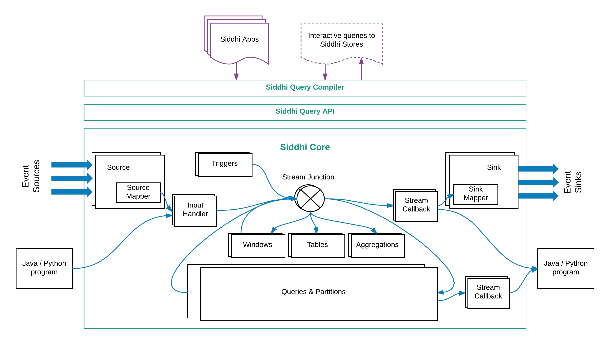

# Siddhi Architecture 

WSO2 Siddhi is a software that can run as server by it own or within WSO2 Stream Processor, embalmed in to Java based 
systems and Android applications to provide analytical operators, orchestrate data flow, calculate analytics, and detect
patterns on event data from multiple, disparate live data sources to allow developers to build applications that sense, 
think, and act in real time.

This section illustrate the architecture of Siddhi and take you through its key functionality; We hope that the article 
will help developers to better understand the code, and will help them to better used siddhi, fix bugs and also improve Siddhi. 

## Main design decisions behind Siddhi

- Siddhi is implemented specifically for event by event processing of real-time streaming data. 
- It provides an intuitive way to expressing stream processing logic and Complex 
Event Processing constructs like Patterns and Sequences with its Siddhi Streaming SQL.  
- It processes all events in-memory and when necessary it also keeps its processing state in-memory. 
- It enforces strict schema for event streams such that it can precompile the queries to support efficient event data retrieval, 
manipulation, optimise performance and to optimise memory consumption.  
- All processing is optimise for memory consumption by only having the absolute necessary information in memory and 
dropping the rest as soon as possible. 
- Have multiple extension points to support diverse set of functionality such as supporting multiple sources, sinks, functions, 
aggregation operations, windows and many more.

## High level architecture

 
In very high level Siddhi consumes events from various events source processed them according to the defined Siddhi application 
 and produce results to subscribed event sinks. 
 Siddhi stores its processing events in in-memory table or when configured on external data stores such as `RDBMS`, `MangoDB`, 
 `Hazelcast` in-memory grid, etc. Siddhi also allows applications and users to query Siddhi via its Store Query API to interactively 
 retrieve data from its in-memory and other stores.
 
### Main Components of Siddhi

Siddhi comprises four main components, they are: 

- **Siddhi Query API** : This let you define execution logic via the Siddhi application and its queries and definitions using POJO classes. 
Internally Siddhi uses these object to understand what user expects Siddhi to do. 

- **Siddhi Query Compiler** : This let you use the Siddhi Streaming SQL to define the Siddhi application and its queries and definitions, 
 and it converts the Streaming SQL to Siddhi Query Objects such that Siddhi to execute them. 
 
- **Siddhi Core** : This is responsible for building the execution runtime and processing events as and when they arrive. 
 
- **Siddhi Annotation** : This is a helping component that lets all extensions to be annotated such that they can be 
pricked by Siddhi Core for processing and help you generate appropriate documentation. 

###Siddhi Component Architecture 

The following diagram gives more detail information on all the sub components of Siddhi and the flow of events though them. 

 
####Siddhi components

- Stream Junction
    
    Responsible for routing events to various components within Siddhi core, there will a Stream Junction for each 
    defined or inferred stream in the siddhi Siddhi App 
    
- Table
- Window
- Trigger 
- Aggregation 

- Query
    - filter
    - window
    - join 
    - pattern/sequence 
    
- Partition
    - inner stream
